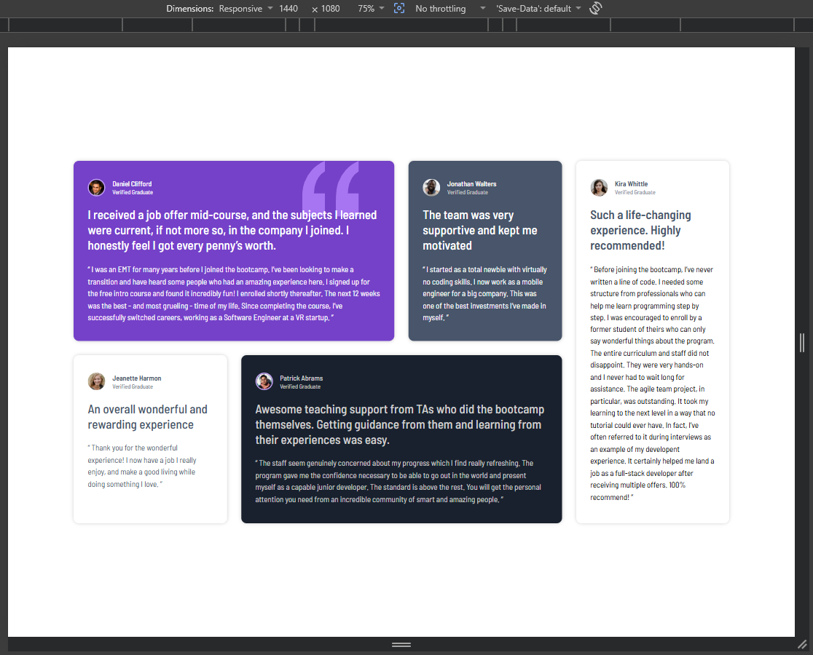
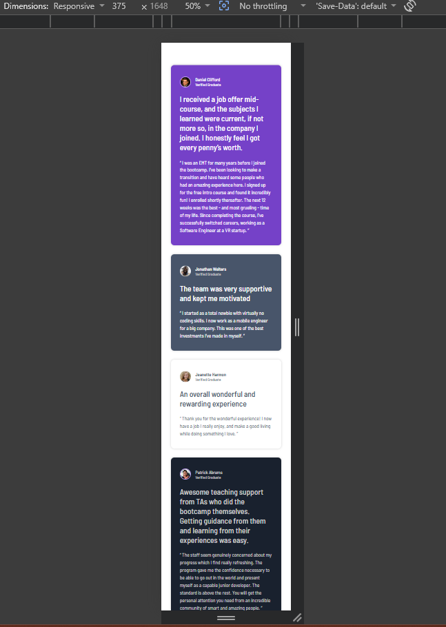

# Testimonials grid section 

This is a solution to the [Testimonials grid section challenge on Frontend Mentor](https://www.frontendmentor.io/challenges/testimonials-grid-section-Nnw6J7Un7).

## Table of Contents

* [Overview](#overview)
* [Screenshot](#screenshot)
* [Links](#links)
* [Built With](#built-with)
* [What I Learned](#what-i-learned)
* [Continued Development](#continued-development)
* [Author](#author)

## Overview

A clean and modern testimonials layout built using a grid system. The project features a responsive grid section displaying multiple user testimonials with custom backgrounds, quotes, profile pictures, and an asymmetric layout on desktop screens achieved via CSS Grid areas.

### Screenshot

**Desktop View**

**Mobile View**

## Links

* [Live URL](https://)
* Repository: [Github](https://)

## Built With

* **Semantic HTML5** (Markup using `<main>`, `<figure>`, `<figcaption>`, and `<blockquote>`)
* **CSS3** (Custom properties, Media queries)
* **CSS Grid** (Grid areas, fractional units, and responsive layouts)
* **Flexbox** (For alignment within profile headers and layout centering)
* Google Fonts (Barlow Semi Condensed)

## What I Learned

This project helped me strengthen my skills in:

* Structuring complex card components using semantic tags like `<figure>`, `<figcaption>`, and `<blockquote>`.
* Implementing asymmetrical layouts using CSS Grid properties like `grid-template-areas`, `grid-area`, and explicit column spans.
* Managing overlapping visual layers and absolute decorative elements using `position: absolute` and `z-index`.
* Creating maintaining scalable typography and spacing using relative units (`rem`, `em`).
* Handling variable content distributions while maintaining a cohesive visual hierarchy.

## Author

* GitHub - [vo1d-bot](https://github.com/vo1d-bot)
* Frontend Mentor - [vo1d-bot](https://www.frontendmentor.io/profile/vo1d-bot)

---

**Feedback & Suggestions Welcome!**
Feel free to leave any feedback or suggestions to help me improve.